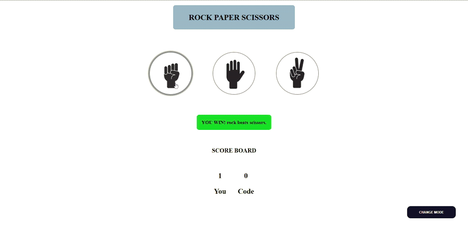
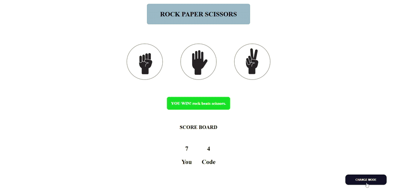

<h1>✊🖐️✌️ Rock Paper Scissors — JavaScript Game</h1>

  This is a fun and interactive <strong>Rock Paper Scissors</strong> browser game built using <strong>HTML, CSS, and JavaScript</strong>. It features score tracking, dynamic gameplay logic, and a toggle between <strong>light</strong> and <strong>dark mode</strong>. Users can play against a randomly generated computer choice and see immediate visual feedback.

<h2>🔗 Live Demo</h2>

  <a href="https://ks-fsdev.github.io/Rock-Paper-Scissors/" target="_blank">
    👉 Play the Game
  </a> 
  ⚠️ <em>Note: Some browsers like Chrome may show a security warning. This is a personal GitHub-hosted project and completely safe.</em>

<h2>🎮 Features</h2>
<ul>
  <li>Real-time Rock-Paper-Scissors gameplay</li>
  <li>Scoreboard to track user's and computer's scores</li>
  <li>Dynamic game messages (win, lose, draw)</li>
  <li>Light/Dark mode toggle with image switching</li>
  <li>Animated hover and visual effects</li>
</ul>

<h2>🧠 What I Practiced</h2>
<ul>
  <li>DOM manipulation with <code>querySelector()</code> and <code>addEventListener()</code></li>
  <li>Conditional game logic and random number generation</li>
  <li>CSS styling and hover transitions</li>
  <li>Creating responsive layouts with Flexbox</li>
  <li>Working with toggle modes and dynamic image switching</li>
</ul>

<h2>📁 Folder & File Structure</h2>
<table>
  <thead>
    <tr>
      <th>File/Folder</th>
      <th>Description</th>
    </tr>
  </thead>
  <tbody>
    <tr>
      <td><code>index.html</code></td>
      <td>Main game layout and structure</td>
    </tr>
    <tr>
      <td><code>style.css</code></td>
      <td>Game styling, transitions, theme modes</td>
    </tr>
    <tr>
      <td><code>script.js</code></td>
      <td>Handles all game logic and DOM interactions</td>
    </tr>
    <tr>
      <td><code>images/</code></td>
      <td>Hand sign images for both light and dark mode</td>
    </tr>
    <tr>
      <td><code>ss/</code></td>
      <td>GIFs or screenshots used for README previews</td>
    </tr>
  </tbody>
</table>

<h2>📸 Gameplay Demo</h2>

<strong>🕹️ Full Game Playthrough</strong>

<strong>🌓 Light/Dark Mode Toggle</strong>

<h2>🛠️ Technologies Used</h2>
<ul>
  <li>HTML5</li>
  <li>CSS3 (Flexbox, Transitions)</li>
  <li>JavaScript (DOM, Logic, Events)</li>
</ul>

<h2>About Me</h2>

  I built this project to learn how to apply conditional logic, random behavior, and DOM updates in a real web game. The process also helped me get comfortable with interactive UI design and feature toggles for improved user experience.

